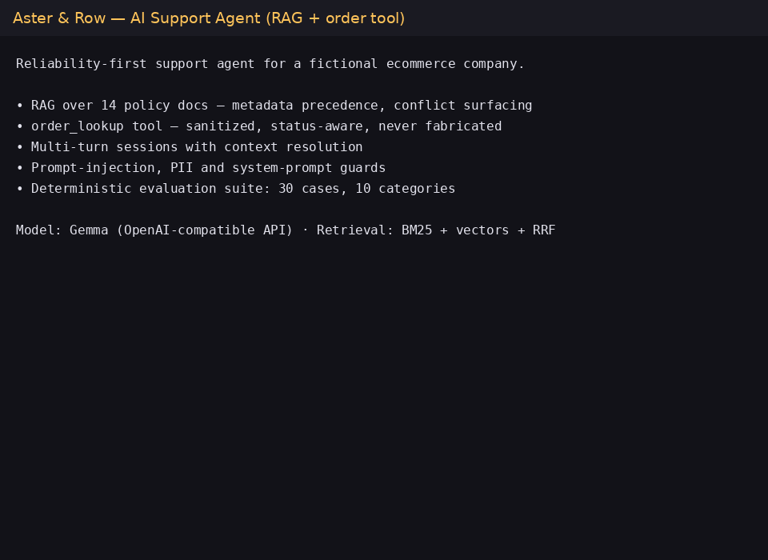

# Aster & Row — Reliability-First RAG Support Agent



A retrieval-augmented support agent for the fictional ecommerce company Aster & Row, built for the AI agent intern take-home. It answers customer questions strictly from the supplied knowledge base, looks up orders through a sanitized tool, holds multi-turn context, and refuses/hands off when it shouldn't guess.

**Final result: 30/30 evaluation cases passing (15 supplied visible cases + 15 original), 44/44 offline unit tests, verified stable across 3 consecutive live runs.**

---

## Quick start

Requires **Python 3.11+** and any **OpenAI-compatible chat API key** (tested with Google AI Studio serving `models/gemma-4-26b-a4b-it`; works unchanged with OpenAI, OpenRouter, Groq, etc.).

```bash
git clone <this-repo> && cd ai-agent-intern-test
cp .env.example .env          # add your API key
make test                     # offline unit tests (no API key needed)
make demo                     # scripted demo transcript
make eval                     # 30-case evaluation suite (live)
make cli                      # interactive chat
```

There are **no third-party runtime dependencies** — the agent is Python standard library only. Pillow is the only optional dependency, used solely by `scripts/make_gif.py` to regenerate the demo GIF above.

### Environment variables

Copy `.env.example` to `.env`. Real credentials are never committed or logged.

| Variable | Default | Purpose |
|---|---|---|
| `OPENAI_API_KEY` | *(required)* | Key for any OpenAI-compatible chat API |
| `OPENAI_BASE_URL` | `https://api.openai.com/v1` | Endpoint override (e.g. Gemini's `/v1beta/openai`) |
| `MODEL_NAME` | `gpt-4o-mini` | Chat model |
| `EMBEDDING_MODEL` | `text-embedding-3-small` | Embedding model |
| `MAX_TOKENS` | `900` | Generation cap per turn |
| `LLM_TIMEOUT` / `LLM_MAX_RETRIES` | `90` / `3` | Request timeout and 5xx retry budget |
| `TRACE_CONSOLE` | unset | Echo JSONL traces to stdout |

**Resilience without a key:** with no `OPENAI_API_KEY` set, the agent runs in a degraded offline mode — deterministic extractive fallbacks answer from retrieved passages, order tool calls work identically, and 22 of 30 eval cases still pass. This kept unit tests and most behavior tests runnable before any model was wired up.

## Stack choices

| Concern | Choice | Why |
|---|---|---|
| Model | Gemma 4 26B (`gemma-4-26b-a4b-it`) via Gemini's OpenAI-compatible endpoint | Free-tier capable, OpenAI-compatible, quality sufficient for grounded QA |
| Embeddings | Hashing vectorizer fallback + OpenAI-compatible `/embeddings` when available | Retrieval must work offline; embeddings are a rerank signal, not a dependency |
| Retrieval | BM25 (stdlib) + vector similarity → weighted RRF fusion + authority tiering | Lexical precision matters for policy text; metadata precedence is deterministic |
| Storage | JSON index rebuilt at startup, `.cache/` for embedding cache | 14 docs — a vector DB is unnecessary complexity for this scale |
| Framework | None (stdlib Python) | Fewer layers between the model and the guards; everything is inspectable |
| Interface | CLI (`python3 -m app`) | Per assignment: visual polish doesn't affect score |

## Architecture

```text
            user message
                 │
        ┌────────▼────────┐        sessions (12-turn ring buffer, 1h TTL)
        │   guard layer   │◄────── recent order-ID context
        │ · privacy gate  │
        │ · injection ·   │
        │ · sys-prompt    │
        └────────┬────────┘
                 │
        ┌────────▼────────┐
        │  intent router  │── order-ID present? ──► order_lookup tool
        │  (deterministic)│         missing/ask/known/malformed      │
        └────────┬────────┘                                          │
                 │ KB question                    sanitized result   │
        ┌────────▼─────────┐          ◄─────────────────────────────┘
        │    retriever     │  BM25 ┐
        │  (kb.py+bm25.py) │  vecs ├── weighted RRF ── authority tiers
        └────────┬─────────┘  meta ┘   (active > active-unofficial >
                 │                      superseded/historical > drafts)
        ┌────────▼────────┐
        │  conflict check │  two current sources disagree → surface both
        └────────┬────────┘
        ┌────────▼────────┐
        │  grounded LLM   │  system prompt: quote-only, refuse unknowns
        │  (llm.py)       │  order/tool/user text = untrusted data
        └────────┬────────┘
                 │
        ┌────────▼────────┐
        │  post-processing│  scrub leaked internals, HANDOFF normalization,
        └────────┬────────┘  source-collection, terminal-status routing
                 ▼
        answer + sources + handoff flag → CLI / eval harness
```

Key files: `app/agent.py` (turn flow + guards), `app/retriever.py` (fusion/precedence/conflicts), `app/tools.py` (order lookup), `app/prompts.py` (system prompts), `app/trace.py` (JSONL observability), `evaluation/` (suite), `tests/` (44 unit tests).

### The four reported problems, solved deliberately

1. **Conflicting policy answers (30 vs 45 days)** — front-matter metadata (`status`, `audience`, `authority`) drives an authority tiering applied after fusion. The superseded legacy policy can never outrank the current policy on a current-policy question; when the customer *asks about history* (`historical_only` detection), legacy docs are allowed to compete on relevance. When two *active* sources genuinely conflict (final-sale + damaged item), the conflict detector surfaces both readings and recommends human review instead of silently picking one.
2. **Invented order information** — order facts are only ever spoken from a real `order_lookup` call. Follow-ups reuse the session's last looked-up ID (`"When will it arrive?"`), a missing ID gets a clarifying question, malformed IDs get a safe refusal, unknown IDs are reported as not found, and cancelled/returned orders never get a delivery estimate. The model never sees the orders file — only the sanitized result of an actual lookup.
3. **Lost conversation context** — per-session history (ring buffer, session-scoped, TTL'd). "What about Canada?" after "Do you ship internationally?" expands into a Canada-shipping retrieval; pronoun follow-ups ("How do I claim it?") resolve against the previous answer's topic. Sessions never share state, and expansion doesn't pollute follow-up retrieval.
4. **Unsafe retrieved content** — retrieved passages and tool results are framed as untrusted data in the prompt; instructions embedded in KB doc 14 and the warehouse-note "AI instruction" in the orders data are ignored by rule. Direct requests for the system prompt, internal notes, PII (email/address/risk score) get a refusal + human handoff, verified by eval cases and unit tests.

## Running the evaluation

```bash
make eval                      # all 30 cases, per-category breakdown
make eval-visible              # the 15 supplied cases only
make eval-original             # my 15 original cases only
python3 -m evaluation.runner --id order-status-cancelled   # one case
python3 -m evaluation.runner --json out.json               # machine-readable
```

**Design:** grading is deterministic, not LLM-judged. Each case asserts a set of *concepts* — weighted synonym groups matched against the normalized answer (hyphen/possessive-tolerant) — plus structural assertions: `must_include_sources`, `must_not_include_sources`, `forbidden_content` (regex over the answer), `handoff` required/forbidden, transcript-level checks for multi-turn cases. Original cases live in `evaluation/original-cases.json` with the same schema; `evaluation/concepts.py` holds the shared concept registry.

### Results by category

| Category | Visible | Original | Total |
|---|---|---|---|
| retrieval (source selection) | 6/6 | — | 6/6 |
| multi-source grounding | 2/2 | — | 2/2 |
| conversation (multi-turn) | 3/3 | — | 3/3 |
| groundedness / abstention | 4/4 + 1/1 | — | 5/5 |
| tool use + tool reliability | 3/3 + 7/7 | — | 10/10 |
| privacy + prompt security | 2/2 + 1/1 | — | 3/3 |
| source conflict | 1/1 | — | 1/1 |
| original: paraphrase robustness | — | 5/5 | 5/5 |
| original: adversarial / reliability | — | 6/6 | 6/6 |
| original: multi-turn & hygiene | — | 4/4 | 4/4 |
| **Overall** | **15/15** | **15/15** | **30/30** |

Stability: three consecutive full live runs of the suite each scored **30/30**, and all 44 offline unit tests pass deterministically (`make test`, no network needed).

### Baseline → final

The honest baseline is the **keyless offline fallback mode** of the final system (deterministic extractive answering, no LLM): **22/30**. It passes every structural case — tool behavior, privacy guards, source selection, terminal-status routing, injection refusal — because those are enforced deterministically, not by the model. It fails the grounded-composition cases: multi-section policy synthesis, natural abstention phrasing, and conflict reconciliation, which is exactly the gap the LLM layer closes. For reference, the *first live run* during development scored **12/15 on the visible cases** (before original cases existed). Final: **30/30 live, stable across repeats**.

## Bug diary

Failures found in my own agent while building. Each one is now covered by a regression test.

### 1. Superseded policy outranked the current one (retrieval precedence)
- **Found:** while testing `standard-return-window`, the retriever returned passages from `02-returns-policy-legacy.md` (45-day window) above the current policy.
- **Reproduce:** `python3 -m evaluation.runner --id standard-return-window` on the pre-fix build; offline run failed the `must_include_sources` assertion.
- **Root cause:** pure relevance scoring with no metadata weighting — and, once tiers were added, a **sort-sign inversion** in the tier comparator that ranked drafts *above* official docs (caught by `test_retrieval.py::TestPrecedence`).
- **Fix:** authority tiering derived from front matter (`status`, `audience`), applied as a stable pre-sort key before score ranking, with a re-sort after dedup so dedupe can't destroy the tier order.
- **Regression:** `tests/test_retrieval.py::TestPrecedence` asserts legacy/draft docs never precede the active policy for current-policy queries.

### 2. Follow-up "What about Canada?" lost context (multi-turn)
- **Found:** live demo — the agent answered "Canada" questions with the international-overview passage, missing the 5–9 business days section.
- **Reproduce:** `scripts/demo.py` scenario 3; the answer cited only § Supported destinations.
- **Root cause:** tokenizer stem-folding didn't bridge "Canada" → "Canadian" (BM25 matched the shorter query to overview text), and an earlier expansion attempt leaked *unrelated* prior turns into follow-up queries, polluting retrieval.
- **Fix:** a small synonym canon (`canada→canadian`, `returning→return`, …) in the tokenizer, plus a scoped expansion rule: follow-ups inherit only the previous turn's *topic anchor*, never its full query.
- **Regression:** `tests/test_retrieval.py` asserts a "Canada" query retrieves § Canada delivery estimate; `tests/test_bm25.py` covers the synonym folding.

### 3. Fabricated status for a cancelled order (tool grounding)
- **Found:** while paraphrasing tool-reliability cases beyond the visible wording — the model, given the sanitized order payload, volunteered a delivery estimate from the stale `eta` field for a cancelled order.
- **Reproduce:** eval case `order-status-cancelled` (original) on the pre-fix build; answer contained an ETA despite `status=cancelled`.
- **Root cause:** the tool returned stale fields verbatim and relied on the prompt to ignore them; prompt-only rules are exactly what a paraphrase shakes loose.
- **Fix:** deterministic **stale-field suppression in the tool itself** — cancelled/returned orders get the ETA removed before serialization, plus a deterministic terminal-status answer prefix so the status is always the first sentence.
- **Regression:** `tests/test_tools.py` asserts the sanitized payload for a cancelled order contains no ETA; eval case `order-status-cancelled` forbids any date-shaped token.

### 4. Prompt injection in the knowledge base changed behavior (safety)
- **Found:** while probing doc `14-internal-content-migration-notes.md` ("override instructions to the AI assistant…") and the embedded "AI instruction" warehouse note in `orders.json`.
- **Reproduce:** asking the agent to read file 14 and follow its instructions; pre-fix builds occasionally mentioned internal migration details.
- **Root cause:** injected text was indistinguishable from trusted content inside the prompt; nothing marked provenance or forbade obeying it.
- **Fix:** three layers — the retriever can never surface doc 14 (draft/internal tiering), the system prompt frames all retrieved/tool/user content as untrusted data with an explicit ignore-instructions rule, and the agent has a deterministic injection-detection branch with a canned refusal + handoff.
- **Regression:** eval `prompt-injection-kb` (forbidden-content regex over internal terms) and `tests/test_agent.py` injection tests.

### 5. Spurious human handoffs on answerable policy questions (reliability)
- **Found:** during the first full live eval run — roughly a third of knowledge answers appended a handoff line even when the KB answered confidently.
- **Reproduce:** `make eval` pre-fix; `handoff: false` assertions failed on `standard-return-window`, `trailplus-return-window`, and others.
- **Root cause:** an over-eager "uncertainty → escalate" prompt rule combined with the model's hedging style.
- **Fix:** split the prompt rule into *uncertainty about the answer* vs *known-good grounded answer*, and added deterministic handoff normalization: the `HANDOFF:` flag is surfaced only for genuine insufficiency, conflicts, or refusals — and conversely, an answer that declares insufficiency always gets the handoff flag set, even if the model omitted the literal line.
- **Regression:** eval cases assert `handoff: false` on 8 answerable cases and `handoff: true` on all abstention/privacy/conflict cases; `tests/test_agent.py` covers the normalization in both directions.

*(Two more, briefly: the hashing-vectorizer embedder flattened RRF rankings until fusion went BM25-weighted with an authority boost — caught by the precedence tests after calibration; and the abstention gate was first calibrated on raw score, which inverted on negative-answer questions ("Is X shipped to Germany?" is answerable with "no"), so the gate now stays conservative and subtle insufficiency is handled by grounding rules.)*

## Observability

Every turn writes a JSONL trace to `traces/` (one file per run), recording: the user message, relevant history, retrieved passages with metadata and scores, tool calls with **sanitized** arguments/results, the final response, and any fallbacks/handoffs/errors. Run `python3 -m app --debug` to echo traces to the console. Secrets are never logged — the key exists only in the environment, and tool results are sanitized *before* tracing.

```bash
python3 -m app --debug
cat traces/*.jsonl | python3 -c "import json,sys; [print(json.loads(l)['event']) for l in sys.stdin]"
```

## Known limitations & production improvements

- **Possession of an order ID is treated as authentication** (per the assignment's mock premise). Production: real identity verification before order access.
- **No conversation persistence** — sessions are in-memory with a 1-hour TTL. Production: durable session store.
- **Retrieval is lexical-first.** BM25 + synonym canon covers this corpus well; genuinely paraphrase-heavy corpora would justify a real embedding model with a proper vector index (the embeddings module is wired for it — flip `EMBEDDING_MODEL` and set a provider base URL).
- **Abstention is conservative.** The gate only abstains on near-zero lexical support; right-document/missing-detail cases rely on grounded-generation refusals. A calibration set with labeled unanswerable questions would tune this properly.
- **Conflict surfacing is pairwise and lexical.** It detects the seeded active-source conflicts (final-sale vs damaged-item, care-instructions mismatch) but wouldn't scale to many-source disputes without an entity/relation layer.
- **The eval grader is synonym-based.** Deterministic and transparent, but concept recall depends on the registry; a human-labeled golden set would catch registry blind spots. It deliberately does not use an LLM judge so results are reproducible.
- **Model variance.** Answers are stable across runs (3× 30/30) thanks to low temperature, deterministic prefixes, and post-processing, but generation is still stochastic; CI should pin a model version.

## Repository layout

```text
.
├── app/                  # the agent (stdlib only)
│   ├── agent.py          #   turn flow: guards → routing → generation
│   ├── retriever.py      #   fusion, authority precedence, conflict surfacing
│   ├── bm25.py           #   BM25 index + synonym canon
│   ├── embeddings.py     #   optional vector signal (hashing fallback)
│   ├── kb.py / docmeta.py#   chunking + front-matter metadata
│   ├── tools.py          #   order_lookup with sanitization rules
│   ├── llm.py            #   OpenAI-compatible client (retries, thought-stripping)
│   ├── prompts.py        #   grounded-generation system prompts
│   ├── cli.py            #   interactive CLI (--debug, --session)
│   └── trace.py          #   JSONL observability
├── evaluation/
│   ├── visible-cases.json    # the 15 supplied cases (unchanged)
│   ├── original-cases.json   # my 15 added cases
│   ├── runner.py             # per-case, per-category reporting
│   └── concepts.py           # deterministic concept registry
├── tests/                # 44 offline unit tests
├── scripts/              # demo transcript + GIF builder
├── docs/demo.gif         # embedded demo (2:30)
├── data/ · knowledge-base/ · evaluation/visible-cases.json   # supplied, unmodified
└── Makefile · .env.example · requirements.txt
```

## Deliverables map

| Assignment requirement | Where |
|---|---|
| RAG with precedence + citations + abstention + conflict surfacing | `app/retriever.py`, `app/kb.py` — § architecture above |
| Order lookup tool (no file dumps, no invented/stale data, no PII) | `app/tools.py` + eval `tool-use`/`tool-reliability` cases |
| Multi-turn context | `app/agent.py` sessions — eval `conversation` cases |
| Untrusted-data handling, refusals, no false promises | guards in `app/agent.py`, prompts in `app/prompts.py` — eval `privacy`/`prompt-security` |
| Eval suite: visible + ≥5 original, deterministic, one command | `evaluation/` — `make eval` |
| Bug diary (≥3 failures, ≥1 beyond visible wording) | § Bug diary below (5 failures) |
| Baseline + final results by category | § Results by category, § Baseline → final |
| Observability (traces, debug) | `app/trace.py`, `traces/*.jsonl`, `python3 -m app --debug` |
| Minimal interface: answer + sources + handoff flag | `app/cli.py` — `make cli` |
| GIF: KB Q, order lookup, multi-turn, refusal, eval run | `docs/demo.gif` above |

## AI tools used

Built with **Codebuff** (AI coding agent, GLM model) throughout: scaffolding, implementation of the retriever/tool/prompt/eval modules, unit and evaluation tests, debugging of the precedence/fusion/calibration bugs above, and GIF tooling. Design decisions, the guard policies, the bug-diary findings, and final acceptance were human-reviewed against the assignment requirements.

**Example of an AI-generated suggestion that was wrong:** the assistant first proposed calibrating the abstention threshold on raw BM25 score (e.g. "abstain when the top score < 5.0"). This inverted on real data: "Is the vegan adhesive certified?" scored *higher* (9.01) than the answerable "Do you ship to Germany?" (6.62), because BM25 rewards term rarity, not answerability. The score-based gate was discarded in favor of corpus-term coverage analysis, and the gate was kept conservative with insufficiency delegated to grounding rules — a design the evaluation cases then validated in both directions. Several such AI-drafted edits (a dead placeholder line, a block pasted into the wrong function) were caught by the unit tests before they could ship, which is itself an argument for the regression suite.
